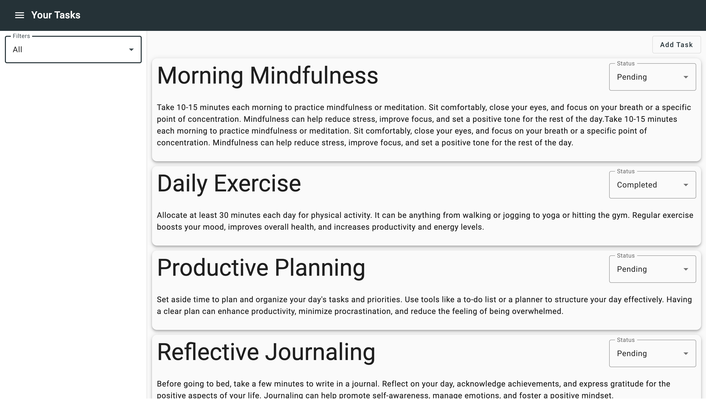

# RationariumNx

# Task Management Application in Angular


s
## Scenario

You are tasked with building a task management application in Angular. The application should allow users to add tasks, mark tasks as completed, and filter tasks based on their completion status. Your task is to implement the necessary components and functionality to achieve these requirements.

## Assessment Tasks

1. Create an Angular project and generate the necessary components for the task management application.

2. Implement the components needed to display a list of tasks.

   - The task list should display the title of each task and provide a way to mark tasks as completed.

3. Include a button or mechanism to filter tasks based on their completion status (e.g., All, Completed, Incomplete).

4. Implement the functionality to add new tasks to the task list.

   - Provide a user interface (e.g., form, input field) to enter task details.
   - When a new task is added, it should appear in the task list.

5. Implement the functionality to mark tasks as completed.

   - Provide a mechanism (e.g., checkbox, button) to mark a task as completed.
   - When a task is marked as completed, its appearance should reflect its completion status in the task list.

6. Implement the filtering functionality to display tasks based on their completion status.

   - When a filter option is selected (e.g., Completed), only tasks matching the selected status should be displayed.

7. Test your implementation by adding tasks, marking them as completed, and verifying that the filtering functionality works as expected.

## Usage

To get started with Rationarium-Nx and run the Todo Task application, follow these steps:

1. Navigate to the project directory:

   ```bash
   cd rationarium-nx
   ```

2. Install dependencies:

   ```bash
   yarn
   ```

3. Serve the Todo Task application:

   ```bash
   yarn nx serve todo-task
   ```

4. Open your web browser and go to [http://localhost:4200/](http://localhost:4200/) to access the Todo Task application.

You should now have the application up and running locally. Feel free to explore the features and functionalities of the Todo Task application. If you encounter any issues or have questions, please don't hesitate to reach out for support. Enjoy managing your tasks with Rationarium-Nx!

## Contributing

If you find any issues or have suggestions for improvement, feel free to open an issue or submit a pull request. We welcome your contributions!
